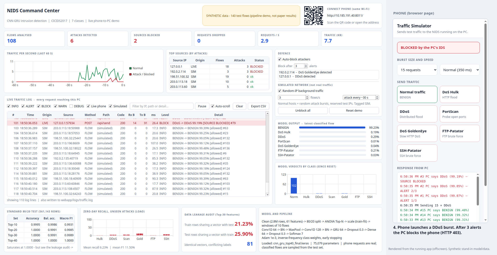
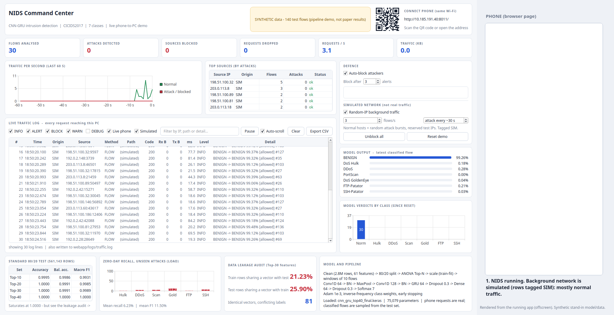
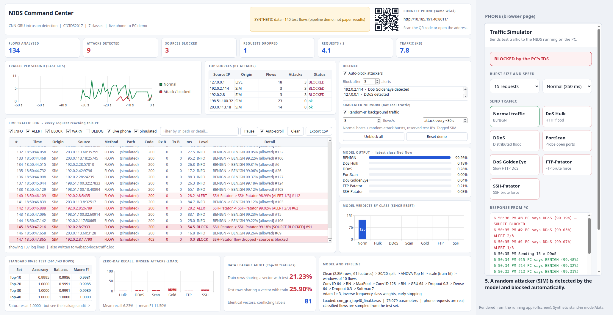
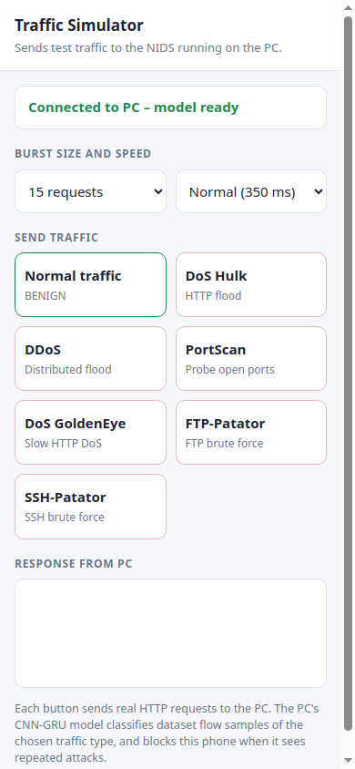
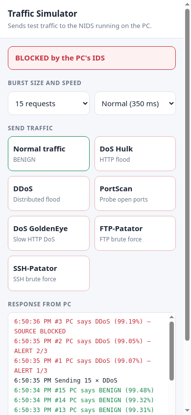

# Intelligent Network Intrusion Detection System

**Team T014** - Final Year Project, Department of Computer Science and Engineering, Rajalakshmi Engineering College

A deep-learning NIDS that classifies network flows into 7 classes (BENIGN, DoS Hulk, DDoS, PortScan, DoS GoldenEye,
FTP-Patator, SSH-Patator) using a **CNN-GRU** model trained on **CICIDS2017**, together with a study of how well such
models really work: **zero-day generalisation** (Leave-One-Attack-Out) and **data leakage** in the standard evaluation split.
It includes a live demo: a phone on the same Wi-Fi sends traffic to a PC, the model classifies it and the PC blocks the attacker.

## Demo

**NIDS Command Center** - one dashboard with live counters, traffic timeline, request log, defence controls, model output
and the research results. The phone page is shown on the right.



| Normal traffic | Random attack blocked |
|---|---|
|  |  |

| Phone connected | Phone blocked after DDoS burst |
|---|---|
|  |  |

**Demo video:** [`T014_DemoVideo.mp4`](T014_DemoVideo.mp4) is a screen recording of the live phone-to-PC demo with a real phone (log rows marked
`LIVE`), on the synthetic stand-in model/data.

**Preview video:** [`app_demo_preview.mp4`](T014_Project/docs/app_demo_preview.mp4) (33 s) shows the same flow: normal traffic, the phone
connecting, a DDoS burst being detected and blocked (HTTP 403), and a random simulated attacker being blocked.

> These screenshots and the preview video are rendered from the running app on **synthetic stand-in data** (the status bar says
> SYNTHETIC) because the original multi-GB dataset and trained weights are not stored in this repository. The phone's requests are
> real HTTP; the model classifies dataset flow samples of the traffic type chosen on the phone. Rows tagged `SIM` are a simulated
> background network on reserved documentation IPs. The research numbers below come from the real runs in `T014_Project/results/`.

## Key results

| Evaluation | Result |
|---|---|
| Standard stratified 80/20 test, Top-40 features | Accuracy 1.0000, Macro-F1 1.0000 |
| Top-10 features only | Accuracy 0.9995, Macro-F1 0.9931 |
| **Zero-day (LOAO), mean over 6 unseen attacks** | **Recall 6.23%, F1 11.50%** |
| **Train/test leakage (Top-30 features)** | **21.23% of train rows and 25.90% of test rows share an identical feature vector; 81 patterns have conflicting labels** |

Near-perfect accuracy on the usual split hides very low recall on attacks the model has never seen, and part of the
"perfect" score comes from duplicated flows. That gap is the project's central finding.

## Run the app

```bash
python -m venv .venv && source .venv/bin/activate
cd T014_Project
pip install -r requirements.txt
pip install tensorflow keras PySide6 segno
python webapp/app.py
```

A window opens with a QR code and a URL. Scan it with a phone on the same Wi-Fi, press a traffic type, and watch the PC detect
and block it. Set `NIDS_PORT` to change the port (default 8000). To regenerate the screenshots and video: `python webapp/record_demo.py`
(needs `pip install imageio-ffmpeg`).

For the real results, copy `cnn_gru_top40_final.keras` into `T014_Project/models/` and `test_top_40_X.npy` / `test_top_40_y.npy` into
`T014_Project/data/processed/sequences_class/`; the status bar then turns green.

## Repository

```text
T014_Project/      code, data layout, results, notebooks, demo app   (details: T014_Project/README.md)
T014_ProjectReport.pdf  project report (Phase I)
T014_Paper.pdf    project paper (zero-day generalisation study)
T014_DemoVideo.mp4 screen recording of the live demo
```

Pipeline, module-by-module run commands and the model architecture are documented in
[`T014_Project/README.md`](T014_Project/README.md) and [`T014_Project/PROJECT_CONTEXT.md`](T014_Project/PROJECT_CONTEXT.md).
